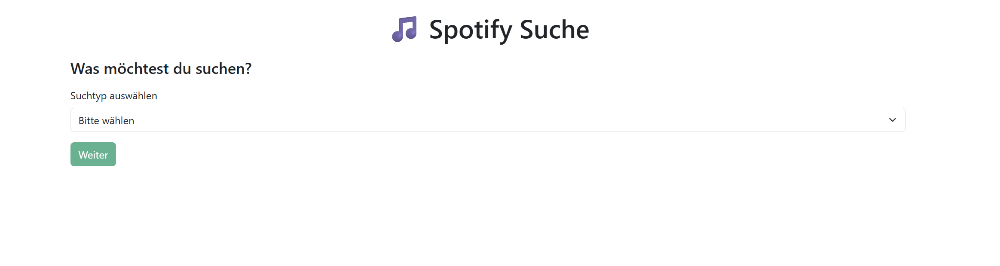

# Spotify-Tracks
Spotify suche

Inhaltsverzeichnis

Überblick

Installation

Verwendung

Technologien

Kompetenzentwicklung

Mitwirken

Lizenz

Autor

Überblick

Dieses Projekt zeigt, wie man eine dynamische, interaktive Webanwendung entwickelt, die Daten von einer API verarbeitet und dem Nutzer übersichtlich präsentiert.

Ziel: Schnelle und benutzerfreundliche Spotify-Suche

Funktionalität: Auswahl von Suchtyp (Song, Künstler, Album), Autovervollständigung, Cards mit Suchergebnissen, Modals mit detaillierten Infos und Accordions für zusätzliche Details

Nutzen: Nutzer erhalten direkt die relevantesten Informationen, können Songs oder Künstler entdecken und über Links direkt auf Spotify zugreifen

👉 Live-Demo ansehen:
https://neviostauffer-crypto.github.io/Spotify-Tracks/

Installation

Schritte zur lokalen Installation und Ausführung:

# Repository klonen
git clone https://github.com/dein-benutzername/spotify-suche.git

# In das Verzeichnis wechseln
cd spotify-suche

# Projekt im Browser öffnen
open index.html  # oder einfach Datei doppelklicken

# Hinweis: Für volle Funktionalität ist ein Spotify API Token erforderlich

Verwendung

Wähle den Suchtyp: Song, Künstler oder Album

Gib einen Suchbegriff ein

Nutze die Autovervollständigung oder klicke auf Suchen

Ergebnisse werden als Cards angezeigt

Klick auf eine Card öffnet ein Modal mit detaillierten Infos

Accordion-Elemente zeigen strukturierte Zusatzinformationen

Auf Spotify öffnen-Button leitet direkt zum Spotify-Eintrag weiter

Beispiel (Screenshot):!
Technologien

HTML5 & CSS3 für Struktur und Styling

Bootstrap 5 für Layout, Cards, Modals, Accordions und Buttons

JavaScript für dynamische Interaktionen, Autocomplete und API-Anfragen

Spotify Web API zur Abfrage von Songs, Künstlern und Alben

Git & GitHub Pages für Versionskontrolle und automatisiertes Deployment

Kompetenzentwicklung

E1+E2 – Projektstart & Formulare:
Ich habe gelernt, ein interaktives Formular zu erstellen, Dropdowns zu nutzen und Eingaben dynamisch einzublenden. Dabei konnte ich frühere Erfahrungen aus dem JavaScript-Modul wiederverwenden und Eingaben validieren.

E3 – API-Anbindung:
Ich habe gelernt, Daten von der Spotify API abzurufen, Formulardaten korrekt zu formatieren und einen Token zu nutzen. Besonders spannend war es, die JSON-Antworten zu verarbeiten und auf der Webseite darzustellen.

E4 – JSON-Daten verarbeiten:
Die empfangenen Daten wurden asynchron verarbeitet, gefiltert, sortiert und auf der Webseite in Cards angezeigt. Ich habe auch gelernt, Fehler abzufangen und Nutzerfeedback zu geben, wenn keine Daten gefunden werden.

E5 – UI/UX:
Ich habe die Benutzeroberfläche übersichtlich und ansprechend gestaltet. Farben, Kontraste, Layout und Rückmeldungen verbessern die Bedienbarkeit und Barrierefreiheit. Ich habe gelernt, dass kleine Details wie Einheitlichkeit der Cards und visuelle Klarheit entscheidend sind.

E6–E8 – Weboberflächen & Interaktionen:
Ich habe komplexe Elemente wie Accordion, Carousel, Modal und Buttons eingesetzt und dynamisch per JavaScript gesteuert. Dadurch entstehen flüssige, interaktive Nutzererlebnisse, die ohne Seitenreload funktionieren.

E9 – Performance, Accessibility, SEO:
Optimierungen wie Deferred Loading, Inline-Critical-CSS, barrierefreie Labels und semantische Überschriften wurden umgesetzt. Die Seite ist schnell, zugänglich und SEO-freundlich.

E10 – Automatisiertes Deployment:
Die Seite wurde über GitHub Pages veröffentlicht, sodass Änderungen automatisch live gehen. Versionskontrolle und Deployment erleichtern die kontinuierliche Weiterentwicklung.

Mitwirken

Beiträge sind willkommen!
Wenn du mithelfen möchtest:

Repository forken

Neuen Branch erstellen:

git checkout -b feature/xyz

Änderungen committen:

git commit -m 'Feature hinzufügen'

Branch pushen:

git push origin feature/xyz

Pull Request stellen

Lizenz

Dieses Projekt steht unter der MIT-Lizenz.
Details siehe Datei LICENSE
.

Autor

Nevio Stauffer
nevio.stauffer@bbzbl-it.ch
neviostauffer-crypto